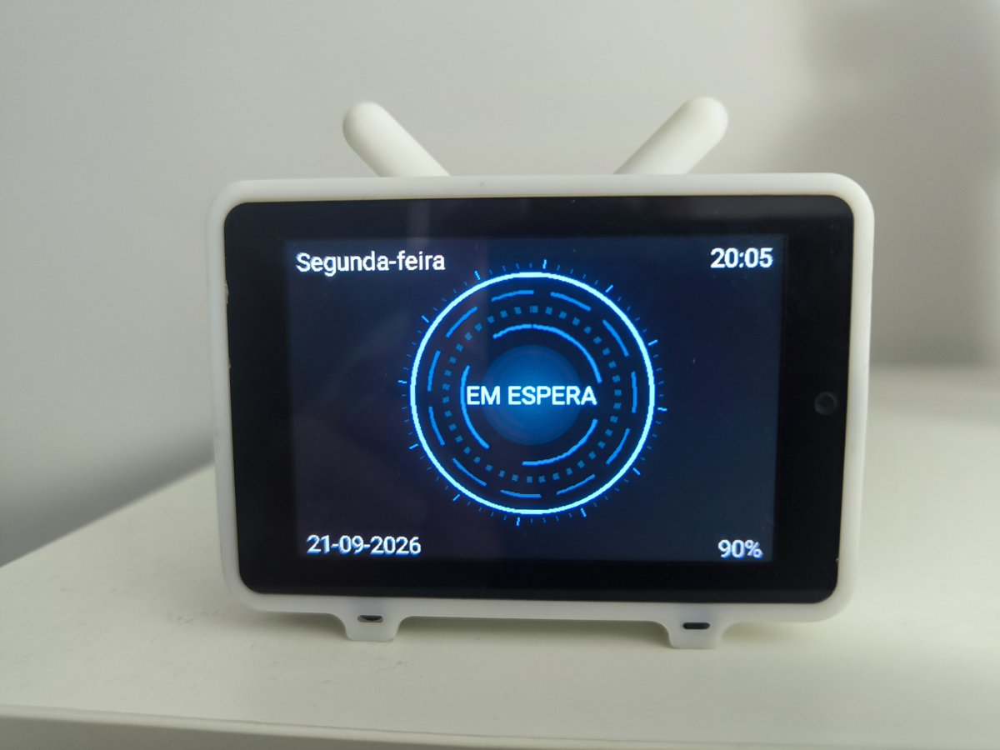
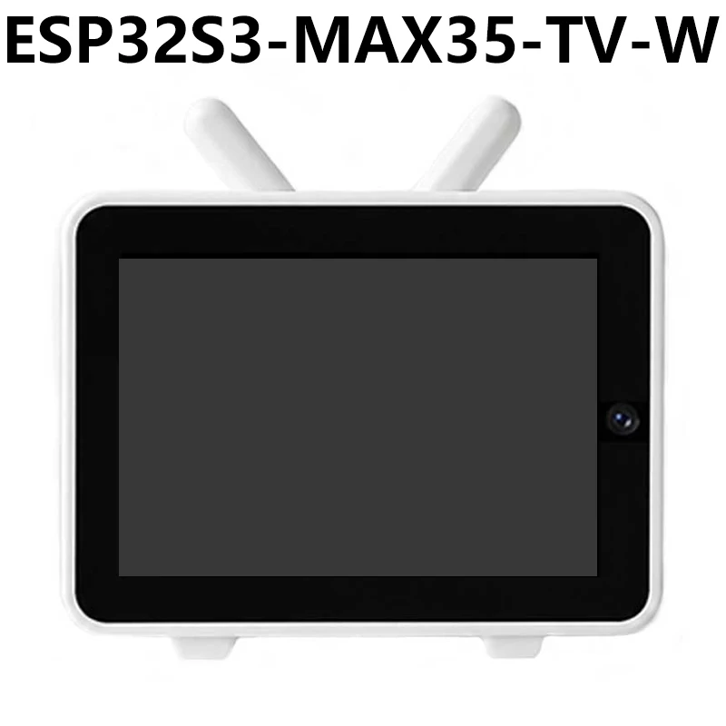
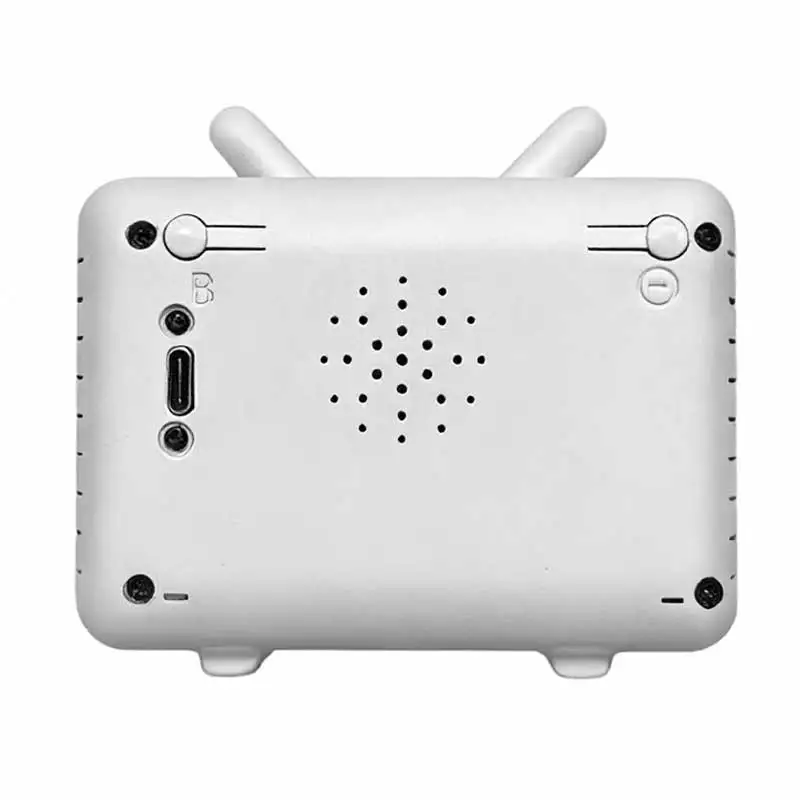
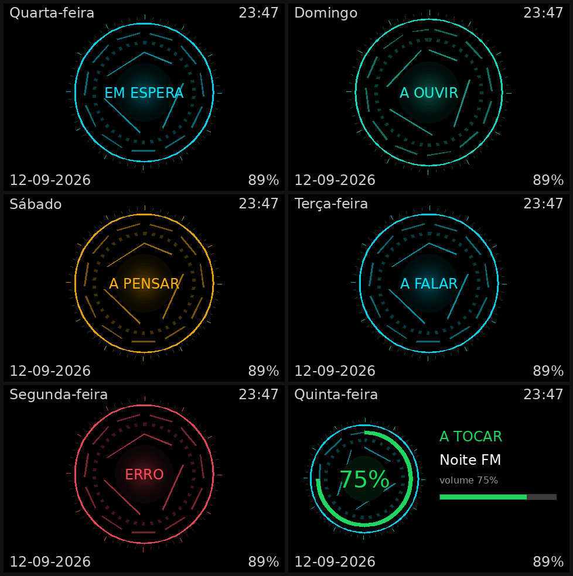

# ESP32-S3 MAX35-TV — Hermes Voice Panel

Turn the **[Spotpear ESP32-S3 MAX35-TV](https://spotpear.com/wiki/ESP32-S3-3.5-inch-LCD-TV-Display-Deepseek.html)**
(3.5" display, dual mic, speaker, battery) into a **local voice assistant for
Hermes Agent**, running as a Home Assistant Assist satellite. Wake word /
push-to-talk → local STT → **Hermes as the HA Conversation Agent** → TTS on the
panel speaker — all local, no cloud, no subscription.

This is a working, verified setup (not a reference skeleton). It reproduces
exactly the configuration running in production: the hardware layer is this
repository; the "brain" is Hermes via
[`rusty4444/hermes-voice-ha-integration`](https://github.com/rusty4444/hermes-voice-ha-integration).

[](LICENSE)
[](https://github.com/byjaps/esp32-max35-tv)
[](https://github.com/byjaps/esp32-max35-tv/releases/latest)
[](https://esphome.io)
[](hardware/README.md)
[](hermes/README.md)
[](docs/troubleshooting.md)

## Features

- **Voice**: wake word (okay nabu) or push-to-talk (BOOT button ≥600 ms),
  local STT, Hermes answers and the panel speaks back.
- **HUD**: animated "arc reactor" state ring on the display — color + speed per
  state (idle/listening/thinking/speaking/error), clock + day upstream,
  battery footer.
- **Media player**: the panel speaker is a HA `media_player` — announcements,
  TTS messages and radio/music work, with a media screen (title + volume ring).
- **Battery**: real voltage ADC (GPIO6) with a Li-ion %, plus charging status.
- **Volume**: one source of truth, sized UI scale → audible floor →
  distortion ceiling, survives reboots.
- **Button gestures**: single click = volume +10%, double click = volume −10%,
  long press = push-to-talk.

## Hardware

- **Board**: Spotpear ESP32-S3 MAX35-TV (`ESP32S3-MAX35-TV-W`) — ESP32-S3,
  3.5" ST7796S (480×320) display, ES7210 dual mic + ES8311 speaker codecs,
  GC0308/OV5640 camera slot, microSD slot, battery connector, type-C.
- **Official resources** (datasheets, schematic, 3D model, factory firmware,
  user guide) are linked from [`hardware/`](hardware/README.md).
- Correct wiring/pins are verified against the manufacturer's own ESPHome file
  (`RealDeco/xiaozhi-esphome`, `spotpear-tv_hw.yaml`) — do not trust
  LLM-generated pinouts for this board.

### Where to buy

The board is sold under the "mini TV" camera-and-voice devboard family. On
**AliExpress** just search **"Xiaozhi max tv"** (the board ships with XiaoZhi
firmware, hence the name). The MAX35-TV-W is the 3.5" reversion here.

### Photos

| | |
|---|---|
|  |  |
| Real panel running this HUD (idle) | Front view (AliExpress) |
|  |  |
| Board view (AliExpress) | The 5 HUD states + media screen (rendered) |

### Disabled features

Some board hardware is deliberately not enabled in this firmware. See
[`docs/disabled-features.md`](docs/disabled-features.md) for rationale and how
to re-enable:

- **Camera** — removed (no IR = blind at night, ESPHome does no image motion
  detection, and it cost RAM/flash/PSRAM). Disabled in the YAML.
- **microSD card** — not configured in this firmware (SD video/music are
  XiaoZhi features and do not exist here).
- **Touch** — this device revision has no GT911 touch controller; the panel is
  voice + HUD only.

## Getting started

**You need**: Home Assistant (with an Assist pipeline) and this panel. Building the
firmware yourself needs ESPHome **2026.9.0** (Python 3.12+); flashing a pre-built
binary needs no build tools at all.

### Option A — flash a pre-built binary (no build tools)

Grab the files from the [**latest release**](https://github.com/byjaps/esp32-max35-tv/releases/latest):

| File | When to use it | How |
|---|---|---|
| `max35tv-v0.15.1-2026.9.0-ota.bin` | the panel already runs ESPHome and has WiFi | OTA — `esphome upload`, or ESPHome Web |
| `max35tv-v0.15.1-2026.9.0-factory.bin` | first flash, over the cable (replaces XiaoZhi) | `esptool ... write-flash 0x0` at offset `0x0` |

Then jump to step 4 below (Home Assistant side). The `2026.8.2` build ships in the
same release as a fallback.

### Option B — build and flash it yourself

1. **Flash ESPHome** onto the board (original firmware is XiaoZhi). See
   [`docs/setup-hermes.md`](docs/setup-hermes.md).
2. **Configure** `secrets.yaml` (copy `secrets.yaml.example`) and adjust names.
3. **Compile + OTA** the YAML: `esphome run esp32-max35-tv.yaml`.

### Either way — Home Assistant side

4. **Install the HA integration** (Hermes as Conversation Agent) —
   [`hermes/`](hermes/README.md).
5. Set up the Assist pipeline to use Hermes as its conversation agent, and select
   the panel as the satellite that uses that pipeline.

> ✅ **Builds and runs on ESPHome 2026.9.0** (the current release). The board
> runs it stable for hours. Validate any change with `esphome config` before
> flashing. After any flash the panel may reboot 2–3 times in the first ~45 min
> while the new image settles — that is expected, not a defect
> ([`docs/troubleshooting.md`](docs/troubleshooting.md)).

## Repository layout

```
esp32-max35-tv.yaml      ESPHome firmware (cleaned, no secrets)
secrets.yaml.example     credentials template (copy to secrets.yaml)
hardware/                official datasheets/schematic + links
scripts/                 diagnostics/helpers (check panel, battery, preview)
assets/                  screen renders + product photos
docs/                    setup + hardware-specific guides
hermes/                  Hermes <-> HA voice integration (rusty4444)
```

## Credits

This project stands on the shoulders of several people:

- **[`rusty4444`](https://github.com/rusty4444) (Sam Russell)** —
  [`hermes-voice-ha-integration`](https://github.com/rusty4444/hermes-voice-ha-integration):
  the HACS component that makes **Hermes** the HA Conversation Agent. It is the
  brain of this voice panel. Includes merged `byjaps` PRs [#42](https://github.com/rusty4444/hermes-voice-ha-integration/pull/42)
  (WebSocket reconnect) and [#46](https://github.com/rusty4444/hermes-voice-ha-integration/pull/46)
  (instant local intent answers).
- **Spotpear** — the board, the official wiki and the hardware documentation.
- **[`RealDeco/xiaozhi-esphome`](https://github.com/RealDeco/xiaozhi-esphome)** —
  the reference ESPHome config for this board (pins, codecs, wake word).
- **[`eadmin2/jarvis_ai`](https://github.com/eadmin2/jarvis_ai)** — the HUD
  "arc reactor" animation, ported from its canvas to the ESPHome display.
- **[`miketomkins`](https://github.com/miketomkins/hey-hermes-wakeword-model)** —
  the "hey hermes" wake word model (tested, not retained; see `docs/wake-word.md`).

## Documentation

- [`docs/setup-hermes.md`](docs/setup-hermes.md) — flashing + wiring the panel to Hermes
- [`docs/wake-word.md`](docs/wake-word.md) — wake word, cutoff, false triggers
- [`docs/audio.md`](docs/audio.md) — shared I2S bus, ES8311 DAC, volume, TTS
- [`docs/battery.md`](docs/battery.md) — battery ADC, charge curve, charging
- [`docs/media-player.md`](docs/media-player.md) — media player, metadata, announcements
- [`docs/disabled-features.md`](docs/disabled-features.md) — camera / SD / touch
- [`docs/troubleshooting.md`](docs/troubleshooting.md) — the hard-won pitfalls

## License

[MIT](LICENSE). The firmware is yours to reuse; the third-party components keep
their own licenses (see Credits).